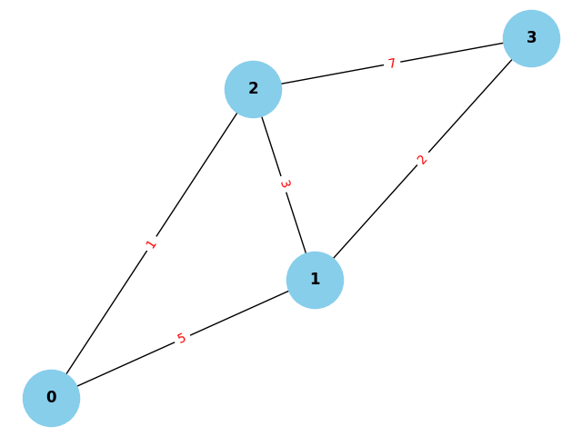

# DrawGraphs

**DrawGraphs** is an interactive tool for creating, visualizing, and manipulating graphs. In this new version, graph nodes are interactive and can be moved manually by clicking and dragging them. 
## Features

- **Customizable Graph Input:** Define the number of nodes, edges, and their weights.
- **Interactive Nodes:** Drag and rearrange nodes manually with your mouse.
- **Weighted Edges:** Add weights to edges for enhanced graph customization.
- **Real-Time Updates:** Node movements are reflected immediately on the graph.
- **Graphical Output:** Displays the graph in an interactive window instead of just saving an image.

---

## Requirements

Make sure you have the following installed:

- **Python 3.6+**
- Required libraries:
  - `networkx`
  - `matplotlib`
  - `tkinter` (usually pre-installed with Python on most operating systems)
  
You can install the required libraries with the following command:

```bash
pip install networkx matplotlib
````

## How to Use

### 1. Clone the Repository
First, clone this repository to your local machine:

```bash
git clone https://github.com/your-username/drawGraphs.git
cd drawGraphs
```

### 2. Run the Program
Execute the program using Python:
```bash
python3 drawGraphs.py
```

### 3. Input Data
### Input Data

When you run the program, you will be prompted to input the following:

1. **Number of Nodes (N):** Enter the total number of nodes in the graph.  
   Example: `4`  

2. **Number of Edges (M):** Enter the total number of edges in the graph.  
   Example: `3`  

3. **Connections and Weights:** For each edge, provide the following details:
   - `n1`: The starting node of the edge.
   - `n2`: The ending node of the edge.
   - `weight`: The weight of the edge.

#### Example Input:
```text
Enter the number of nodes (N): 4
Enter the number of edges (M): 5
Enter the connections (n1, n2, weight) for each edge:
0 1 5
0 2 1
1 2 3
1 3 2
2 3 7
```

### 4. Output
Once the data is entered, an interactive window will open where you can:

1. View the generated graph.
2. Drag and rearrange the nodes with your mouse.
3. Changes are instantly reflected on the graph.

#### Example Output:


### 5. Contriubution
Contributions are welcome! Follow these steps to contribuite:
1. Fork the repository
2. Create a new branch (feature/my-feature):
```bash
git checkout -b feature/my-feature
```
3. Commit your chabges with a descriptive message:
```bash
git commit -am 'Add my feature'
```
4. Push the changes to your branch:
```bash
git push origin feature/my-feature
```
5. Open a Pull Request

### License 
This project is licensed under the MIT License. See the LICENSE file for more information.


### Contact 
If you have questions, feedback, or suggestions, feel free to reach out:

- Email: santiagotob0102@gmail.com
- GitHub: znatii
