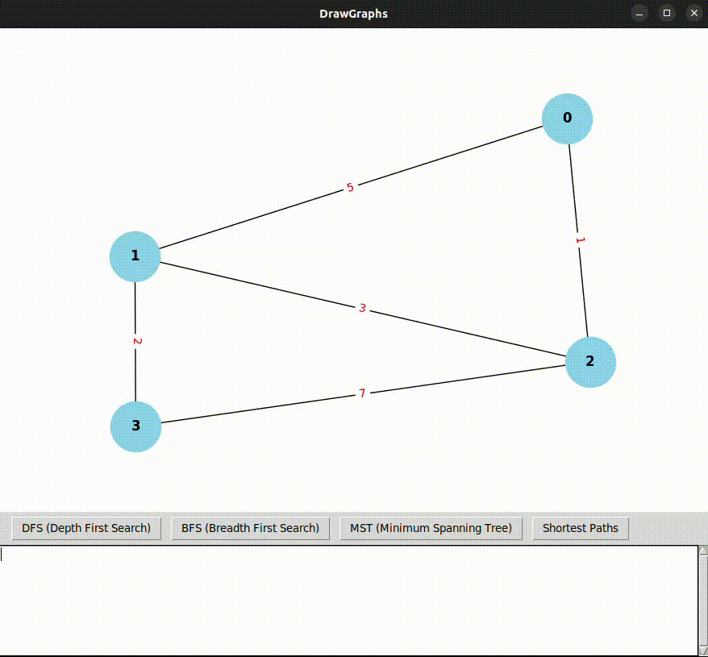

<div align="center">

# DrawGraphs

<div align="justify">

**DrawGraphs** is an interactive tool for creating, visualizing, and manipulating graphs. This version introduces advanced functionalities such as Breadth-First Search (BFS), Depth-First Search (DFS), Minimum Spanning Tree (MST), and Shortest Path calculations. Users can now explore the graph interactively and perform operations directly from the interface.

</div>


</div>

## Features

- **Customizable Graph Input:** Define the number of nodes, edges, and their weights.
- **Interactive Nodes:** Drag and rearrange nodes manually with your mouse.
- **Weighted or Unweighted Graphs:** Choose whether edges have weights or not.
- **Directed or Undirected Graphs:** Select if the graph is directed (with arrows) or undirected.
- **Graphical Output:** Displays the graph in an interactive window instead of just saving an image.

## New Functionalities:
After creating the graph, you can now perform the following operations:
1. **BFS (Breadth-First Search):** Calculates the BFS traversal of the graph starting from a node.
2. **DFS (Depth-First Search):** Calculates the DFS traversal of the graph starting from a node.
3. **MST (Minimum Spanning Tree):** Computes the MST of a weighted graph using efficient algorithms like Kruskal or Prim.
4. **Shortest Paths:** Calculates the shortest paths from each node to every other node using Dijkstra's algorithm.

---

## Requirements

Make sure you have the following installed:

- **Python 3.6+**
- Required libraries:
  - `networkx`
  - `matplotlib`
  - `tkinter` (usually pre-installed with Python on most operating systems)
  
You can install the required libraries with the following command:

```bash
pip install networkx matplotlib
````

## How to Use

### 1. Clone the Repository
First, clone this repository to your local machine:

```bash
git clone https://github.com/your-username/drawGraphs.git
cd drawGraphs
```

### 2. Run the Program
Execute the program using Python:
```bash
python3 drawGraphs.py
```

### 3. Input Data
### Input Data

When you run the program, you will be prompted to input the following:

1. **Directed or Weighted (yes/no):** Choose the options you need.
2. **Number of Nodes (N):** Enter the total number of nodes in the graph.  
   Example: `4`  

2. **Number of Edges (M):** Enter the total number of edges in the graph.  
   Example: `5`  

3. **Connections and Weights:** For each edge, provide the following details:
   - `n1`: The starting node of the edge.
   - `n2`: The ending node of the edge.
   - `weight`: The weight of the edge.

#### Example Input:
```text
Is the graph weighted? (yes/no): yes
Is the graph directed? (yes/no): yes
Enter the number of nodes (N): 4
Enter the number of edges (M): 5
Enter the connections (n1, n2, weight) for each edge:
0 1 5
0 2 1
1 2 3
1 3 2
2 3 7
```

### 4. Output
Once the data is entered, an interactive window will open where you can:

1. **Drag** and rearrange nodes to adjust the layout.
2. Use **buttons** at the top to perform graph operations.
   - DFS
   - BFS
   - MST
   - Shortest Paths

#### Example Output:



### 5. Contriubution
Contributions are welcome! Follow these steps to contribuite:
1. Fork the repository
2. Create a new branch (feature/my-feature):
```bash
git checkout -b feature/my-feature
```
3. Commit your chabges with a descriptive message:
```bash
git commit -am 'Add my feature'
```
4. Push the changes to your branch:
```bash
git push origin feature/my-feature
```
5. Open a Pull Request

### License 
This project is licensed under a Non-Commercial License. You may use, modify, and share the code for non-commercial purposes only. Commercial use requires prior written permission. See the [LICENSE](LICENSE) file for details.

### Contact 
If you have questions, feedback, or suggestions, feel free to reach out:

- Email: santiagotob0102@gmail.com
- GitHub: znatii
